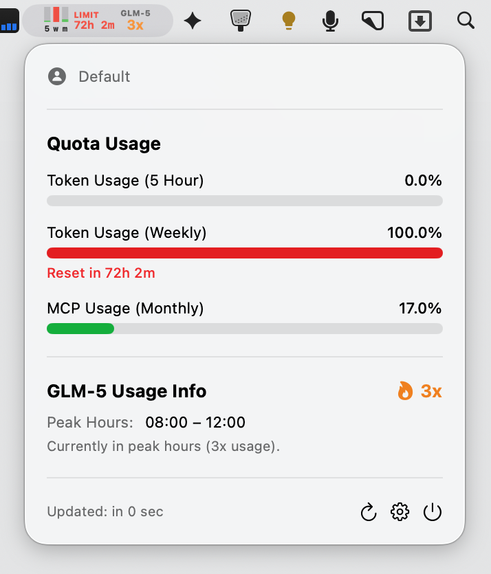

<div align="center">
  
  
  # Z.AI Subscription Widget
  
  A native macOS menu bar app to monitor your Z.AI Coding Plan subscription usage
</div>

---



## Features

- **Quota Display**: View 5-hour token and monthly MCP usage percentages
- **Model Usage**: Per-model token breakdown (input/output)
- **Tool Usage**: MCP tool call statistics
- **Auto-refresh**: Configurable automatic data refresh (1-30 min)
- **Manual Refresh**: On-demand data update
- **Secure Storage**: API key stored in macOS Keychain

## Requirements

- macOS 13.0 (Ventura) or later
- Z.AI API key

## Installation

1. Download the latest `ZaiSubscriptionWidget-*.dmg` from [Releases](https://github.com/anomalyco/zai-subscripton-info/releases)
2. Open the DMG file
3. Drag `ZaiSubscriptionWidget.app` to the `Applications` folder
4. **First launch**: Right-click the app in Applications and select "Open" → "Open" (required for unsigned apps)

> **Note**: This app is not signed with an Apple Developer certificate. On first launch, macOS may show a warning. Use the Right-click → Open method to bypass Gatekeeper.

## Building from Source

### Requirements

- Xcode 15.0 or later

### Option 1: Xcode

1. Open `ZaiSubscriptionWidget.xcodeproj` in Xcode
2. Select "ZaiSubscriptionWidget" scheme
3. Build and run (⌘R)

### Option 2: Command Line

```bash
xcodebuild -project ZaiSubscriptionWidget.xcodeproj \
  -scheme ZaiSubscriptionWidget \
  -configuration Release \
  build
```

The app will be at `build/Build/Products/Release/ZaiSubscriptionWidget.app`

## Setup

1. Launch the app
2. Click the menu bar icon
3. Click the gear icon to open Settings
4. Enter your Z.AI API key
5. Click Save

Get your API key from: https://z.ai/manage-apikey/apikey-list

## API Endpoints Used

| Endpoint | Description |
|----------|-------------|
| `/api/monitor/usage/model-usage` | Model token statistics |
| `/api/monitor/usage/tool-usage` | Tool call statistics |
| `/api/monitor/usage/quota/limit` | Quota percentages |

## Project Structure

```
ZaiSubscriptionWidget/
├── ZaiSubscriptionWidgetApp.swift  # App entry point
├── Models/
│   ├── ModelUsage.swift            # Model usage data model
│   ├── ToolUsage.swift             # Tool usage data model
│   └── QuotaLimit.swift            # Quota limit data model
├── Services/
│   ├── ZaiAPIService.swift         # API client
│   └── KeychainService.swift       # Secure key storage
├── ViewModels/
│   └── UsageViewModel.swift        # Business logic
├── Views/
│   ├── MenuBarView.swift           # Menu bar UI
│   └── SettingsView.swift          # Preferences UI
└── Assets.xcassets/                # App icons and assets
```

## License

MIT License
